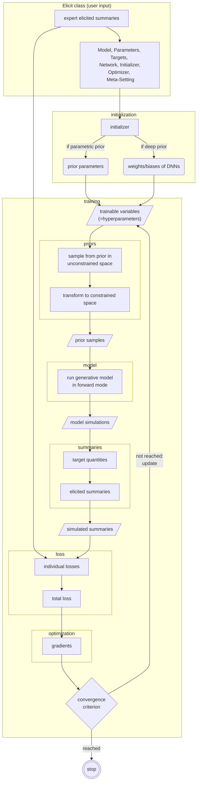

```mermaid
flowchart TB
    subgraph eliobj["Elicit class (user input)"]
            input["Model, Parameters, Targets, \n Network, Initializer, Optimizer, \n Meta-Setting"]
            expert_dat["expert elicited summaries"]
    end
    subgraph initialization["initialization"]
            initializer["initializer"]
            hyper_parametric("prior parameters")
            hyper_deep("weights/biases of DNNs")
    end

    subgraph subGraph3["priors"]
            transformation["transform to constrained space"]
            prior["sample from prior in \n unconstrained space"]
    end
    subgraph model["model"]
            generative_model["run generative model \n in forward mode"]
    end
    subgraph summaries["summaries"]
            elicits["elicited summaries"]
            summary["target quantities"]
    end
    subgraph loss["loss"]
            total_loss["total loss"]
            indiv_loss["individual losses"]
    end
    subgraph optimization["optimization"]
            gradients["gradients"]
    end
    subgraph training["training"]
        subGraph3
        prior_samples[/"prior samples"/]
        model
        model_output[/"model simulations"/]
        summaries
        simulated_summaries[/"simulated summaries"/]
        loss
        optimization
        check{"convergence \n criterion"}
        train_vars[/"trainable variables \n (=hyperparameters)"/]
    end
    input --> initializer
    initializer -- if parametric prior --> hyper_parametric
    initializer -- if deep prior --> hyper_deep
    hyper_parametric --> train_vars
    hyper_deep --> train_vars
    train_vars --> prior
    expert_dat --> indiv_loss & input
    prior --> transformation
    transformation --> prior_samples
    prior_samples --> generative_model
    generative_model --> model_output
    model_output --> summary
    summary --> elicits
    elicits --> simulated_summaries
    simulated_summaries --> indiv_loss
    indiv_loss --> total_loss
    total_loss --> gradients
    gradients --> check
    check -- not reached:<br> update --> train_vars
    check -- reached --> stop((("stop")))

    classDef data shape: lean-r
    class prior_samples data
```
